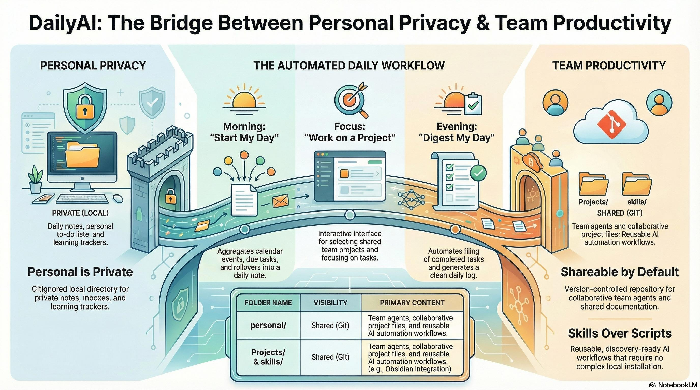

# DailyAI: Team Productivity System

<p align="center">
  
</p>

**Self-hosted, local-first, privacy-focused** AI productivity system for team collaboration using [Agent Skills](https://agentskills.io/specification). Your personal data stays on your machine.

## 🚀 Quick Start

```bash
# 1. Clone the repository
git clone https://github.com/williamgdev/DailyAI.git
cd DailyAI

# 2. Run setup (creates your personal workspace and links skills for Cursor, Claude, Codex, VS Code, openCode, etc.)
./scripts/setup.sh

# 3. Start using (with your AI CLI or Cursor)
# e.g. "start my day" or your CLI's equivalent
```

<details>
<summary>What does setup.sh do?</summary>

The setup script is safe and transparent:
- Creates `personal/` folder with Daily/, ThingsToDo/, ThingsToLearn/ subfolders
- Copies template files for your personal workspace
- Optionally links skills to your AI clients (Cursor, Claude, Codex, VS Code)
- **Never** modifies system files or installs dependencies
- **Never** sends data anywhere - everything stays local

You can audit the script at `scripts/setup.sh` before running.
</details>

---

## 📂 Repository Structure

| Folder      | Purpose                                                                 | In version control?        |
| ----------- | ----------------------------------------------------------------------- | -------------------------- |
| `Projects/` | **Team projects and agents** — work the team is collaborating on       | ✅ Yes (shared, pushed)    |
| `skills/`   | Agent skills (automation workflows)                                     | ✅ Yes                     |
| `scripts/`  | Setup and test scripts                                                  | ✅ Yes                     |
| `docs/`     | Documentation                                                          | ✅ Yes                     |
| `personal/` | **Your private workspace** — daily notes, inbox, your “create project” | ❌ **No — never pushed**   |

- **Projects/** = shared team agents and projects. Add project folders here; committed and pushed.
- **personal/** = your daily notes, ThingsToDo, ThingsToLearn, and projects you create. Used by “start my day” and “create project.” This folder is gitignored and never pushed to the repository.

---

## 🔌 Available Skills

| Skill | Description | Sample Prompts |
|-------|-------------|----------------|
| [obsidian-workflow](./skills/obsidian-workflow/) | Daily notes, task management, project workflows | "start my day", "digest my day", "work on a project" |

See [skills/README.md](./skills/README.md) for all skills and how to add new ones.

---

## 📋 Core Workflows

### ☀️ Morning: Start My Day

Use your AI CLI or Cursor with a prompt like **"start my day"** (e.g. Claude Code, OpenAI CLI, Gemini CLI, or Cursor in this repo).

Creates your daily note with:
- Calendar events (if configured)
- Critical/due tasks
- Rolled over tasks from yesterday
- Upcoming tasks

### 🌙 Evening: Digest My Day

Use your AI CLI or Cursor with **"digest my day"** to file tasks and create the digest log.

Organizes your day:
- Files tasks to project folders
- Copies meeting notes
- Creates digest log
- Preserves daily note as permanent record

### 🎯 Anytime: Work on a Project

Use your AI CLI or Cursor with **"work on a project"** for interactive project selection.

Interactive workflow:
- Shows all projects
- Lets you select one
- Shows tasks
- Helps you focus

---

## 📖 Documentation

| Guide | Description |
|-------|-------------|
| [Onboarding](./docs/ONBOARDING.md) | Complete setup guide |
| [Onboarding mock-up](./docs/ONBOARDING_MOCKUP.md) | Full walkthrough (clone → setup → first use) |
| [Requirements](./docs/REQUIREMENTS.md) | System requirements |
| [Contributing](./docs/CONTRIBUTING.md) | How to add skills/projects |

---

## 🧪 Testing

Test the setup process (simulates a fresh coworker machine):

```bash
./scripts/test-setup.sh
```

---

## 🛠️ Requirements

- Git 2.0+
- An AI CLI (e.g. OpenAI CLI, Claude Code, Gemini CLI) or Cursor — optional; for running skills from the terminal or IDE
- (Optional) Obsidian for UI
- (Optional) Calendar integration if you use a calendar skill

To have Cursor, Claude, Codex, VS Code, or openCode discover skills automatically, run: `./scripts/setup-skill-clients.sh`. Re-run after adding a new skill under `skills/`.

See [docs/REQUIREMENTS.md](./docs/REQUIREMENTS.md) for details.

---

## 📚 Links

- [Agent Skills Specification](https://agentskills.io/specification)
- [Obsidian](https://obsidian.md)

---

## Key Concepts

### Skills

**Agent Skills** are reusable AI workflows that agents discover and execute. They follow the [agentskills.io specification](https://agentskills.io/specification).

**Key features**:
- Discoverable from the repository
- No installation required
- Self-contained with templates
- Shareable across the team

### Projects

**Projects/** — shared team projects and agents. Add project folders here when needed; see [Projects/README.md](./Projects/README.md). Starts empty.

### Personal workspace

**personal/** — used by "start my day" and "create project":
- ThingsToDo (your inbox), ThingsToLearn (learning tracker), your projects as `personal/[ProjectName]/`
- The **personal** folder is gitignored and **never pushed** to the repository; only you have it.

---

## 🤝 Contributing

We welcome contributions! See [docs/CONTRIBUTING.md](./docs/CONTRIBUTING.md) for:
- How to add a new skill
- How to add a team project
- Pull request process
- Style guidelines

Quick add skill:

```bash
mkdir -p skills/my-skill/references
# Create SKILL.md following the specification
# Update skills/README.md
git add skills/my-skill
git commit -m "feat: Add my-skill"
```

---

## 📊 Repository Stats

- **Skills**: 1 (obsidian-workflow)
- **Team Projects**: 0 (add project folders under `Projects/` when needed)
- **Documentation**: 3 guides

---

## 💡 Philosophy

This system follows these principles:

1. **Skills over scripts** - Use Agent Skills specification for portability
2. **Shareable by default** - Team collaboration is easy
3. **Personal is private** - Your daily notes are gitignored
4. **Simple onboarding** - Clone, setup, use
5. **Test before merge** - Real simulation testing

---

**Questions?** See [docs/ONBOARDING.md](./docs/ONBOARDING.md) or ask in team chat.
